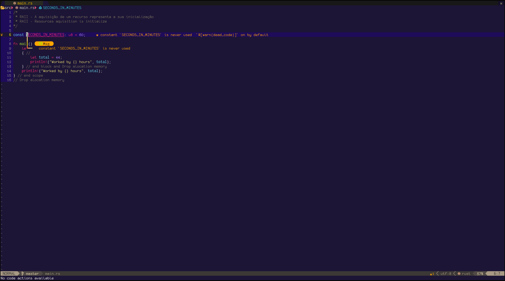
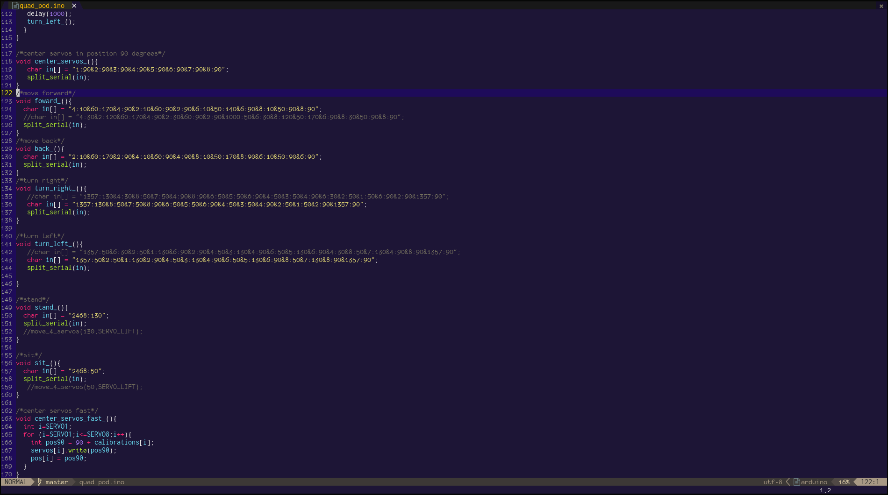
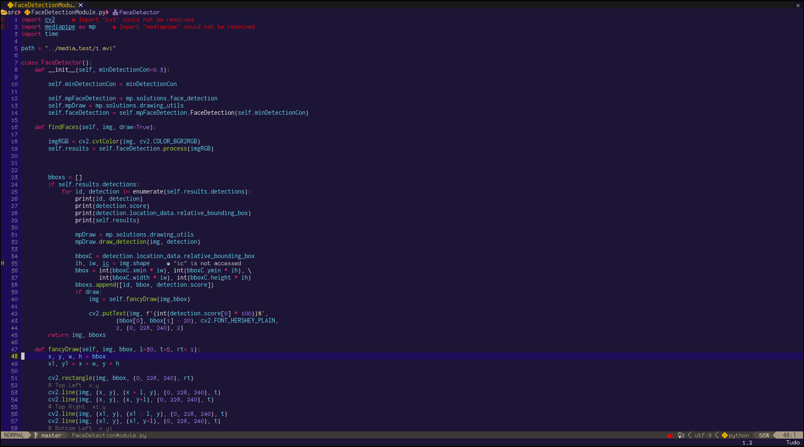
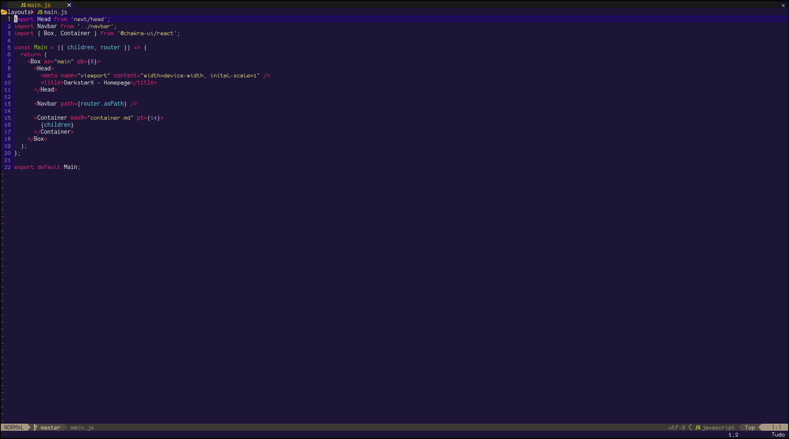
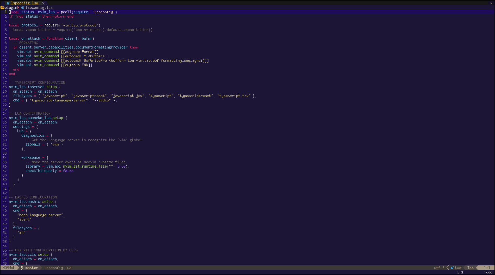

<div id="top"></div>

<!-- PROJECT LOGO -->
<br />
<div align="center">
  <h3 align="center">Midnight Monokai 🍇</h3>
  <p align="center">
    <br />
    <a href="https://github.com/darkstar-x/frost-pkg/issues">Report Bug</a>
    ·
    <a href="https://github.com/darkstar-x/frost-pkg/issues">Request Feature</a>
  </p>
</div>

<!-- ABOUT THE PROJECT -->
## About The Project
> Midnight monokai is a beatiful theme based on default `sublime text3 monokai`<br><br>
Supported on:<br>
✓ NEOVIM<br>
✓ VIM

<!-- GETTING STARTED -->
<div id="getting-started">

## Getting Started 🚀

Using Packer nvim
```sh
use 'darkstar-x/midnight-monokai'
```
Using Plug
```sh
Plug 'darkstar-x/midnight-monokai'
```
## Usage

```sh
:color midnight-monokai
```
or
```sh
:colorscheme minight-monokai
```

## Examples 💡

Example for Bash language


Example for Rust language


Example C++ variant for arduino



Example for Python



Example Javascript-react and Typescript-react



Example for Lua language 🌕

